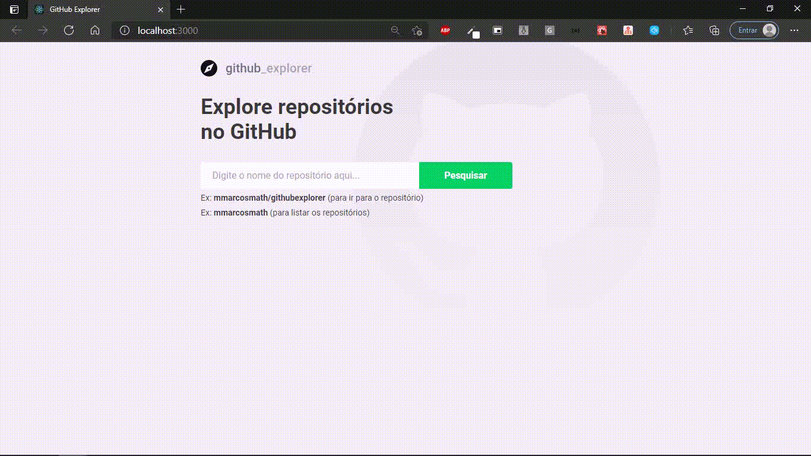
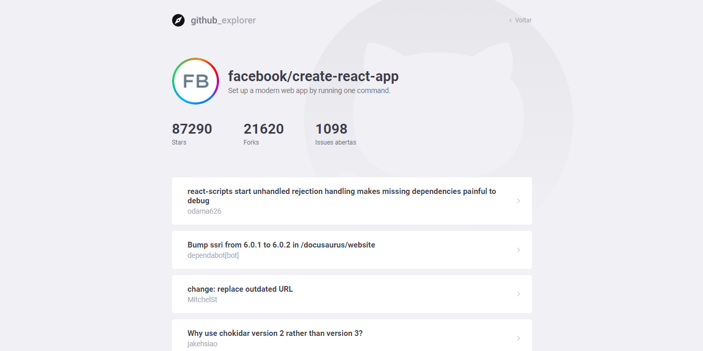

# Github Explorer

Explore respositórios ou autores no Github.

## Como funciona?

Ex: **mmarcosmath/githubexplorer** (para buscar o repositório)
Ex: **mmarcosmath** (para listar os repositórios do autor)

 

